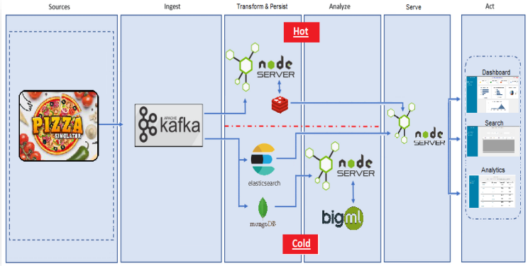
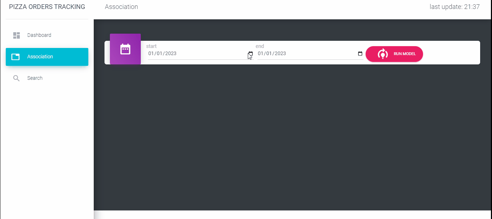
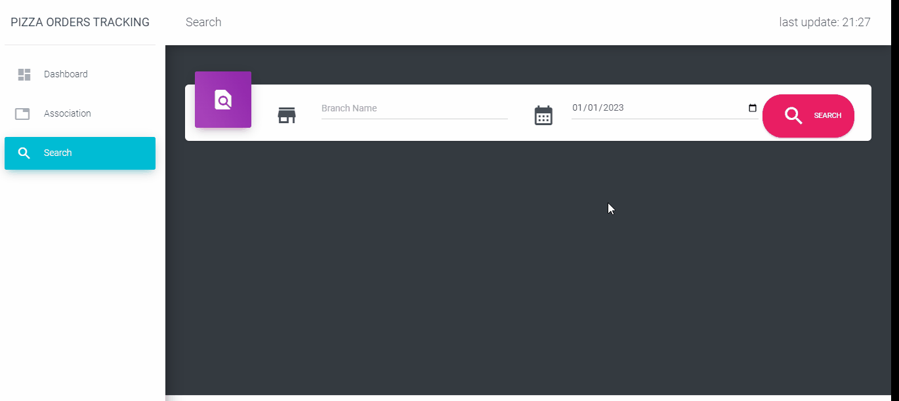

  

<h1 align="center">Big Data Final Project</h1>

- [goal](#goal)
- [architecture](#architecture)
- [Installation](#installation)
- [sturcture](#poject-structure)
- [services](#services)
  

## Goal

To study and simulate data pipeline using various DB
  

## Architecture

This project follows Lambda Architecture

  

## Installation

You can use any part of the project independently.

To install a part, go to the part directory and follow the instructions.
  

## Poject Structure

### app
---
the front end of the application.

In this directory you can find the code for the HTML pages

#### app/dashboard
MVC that creates the dashboard with connection to the REDIS DB

#### app/association
MVC that creates an association rule model using instructions given by the user

#### app/search
MVC that handles a search engine for the user 

### bigML
---
connector from mongoDB to bigML 

### mongoDB
---
connector from kafka to mongoDB

### redis 
---
connector from kafka to redis 

### Pizza_Simulator
---
The simulator that generates the orders data.
  

## Services

